# HTMLandCSS
### Summary
This repository contains a dashboard showing the analysis of WeatherPy in HTML and CSS. 
### Technical Details
In order to run the code, it is required: 
Google Chrome, Firefox or any other explorer. 
### Screenshots
CityLatitudeVs.Cloudiness(%)06-19-2019.png 
06-19-2019.png)  
CityLatitudeVs.Humidity06-19-2019.png 
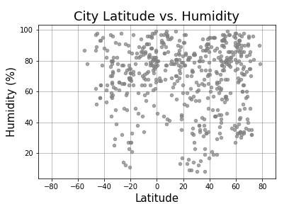  
CityLatitudeVs.MaxTemperature06-19-2019.png 
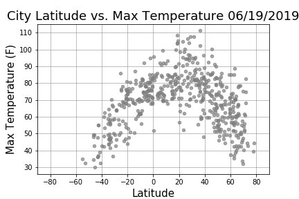  
CityLatitudeVs.WindSpeed(mph)06-19-2019.png 
06-19-2019.png)  
### Explanations 
The outcome is shown in screenshots for reference purpose of the public. 

# HTMLandCSS
Web Visualization Dashboard (Latitude)

Create a dashboard showing the analysis of WeatherPy.

Latitude - Latitude Analysis Dashboard with Attitude
Create a visualization dashboard website plotting weather data.
Create individual pages for each plot and means by which users can navigate between them. 
These pages will contain the visualizations and their corresponding explanations. 
Include a landing page, that is, a page with a comparison of all of the plots.
Add another page where it can be viewed the data used to build the landing page.

Website Requirements
For reference, see the "Screenshots" section below.
The website must consist of 7 pages total, including:

A landing page containing:

An explanation of the project.
Links to each visualizations page.

Four visualization pages, each with:

A descriptive title and heading tag.
The plot/visualization itself for the selected comparison.
A paragraph describing the plot and its significance.

A "Comparisons" page that:

Contains all of the visualizations on the same page so they can be easily compared.
Uses a bootstrap grid for the visualizations.

The grid has two visualizations across on screens medium and larger, and 1 across on extra-small and small screens.

A "Data" page that:

Displays a responsive table containing the data used in the visualizations.

The table must be a bootstrap table component.
The data comes from exporting the .csv file as HTML, or converting it to HTML. 
Pandas has a nifty method approprately called to_html that allows to generate a HTML table from a pandas dataframe.

The website includes a navigation menu at the top of every page that:

Has the name of the site on the left of the nav which allows users to return to the landing page from any page.
Contains a dropdown on the right of the navbar named "Plots" which provides links to each individual visualization page.
Provides two more links on the right: "Comparisons" which links to the comparisons page, and "Data" which links to the data page.
Is responsive (using media queries). The nav must have similar behavior as the screenshots "Navigation Menu" section (notice the background color change).

Finally, the website is deployed to GitHub pages.
When finished, submit to BootcampSpot the links to 1) the deployed app and 2) the GitHub repository.

Considerations

Use bootstrap. This includes using the bootstrap navbar component for the header on every page, the bootstrap table component for the data page, and the bootstrap grid for responsiveness on the comparison page.
Deploy your website to GitHub pages, with the website working on a live, publicly accessible URL as a result.
Use a CSS media query for the navigation menu.
Check that the website works at all window widths/sizes.
Keep the core functionality and make it look snazzy.

Have visualization navigation on every visualizations page with an active state. See the screenshots below.

This section contains screenshots of each page that must be built, at varying screen widths. These are a guide; you can meet the requirements without having the pages look exactly like the below images.

#### Landing page

Large screen: 
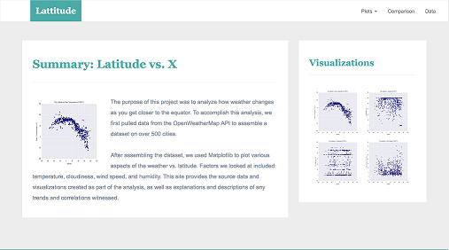

Small screen: 
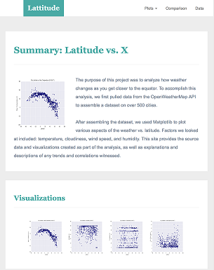


#### Comparisons page

Large screen: 
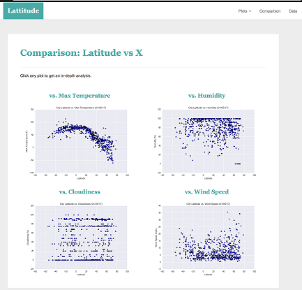

Small screen: 
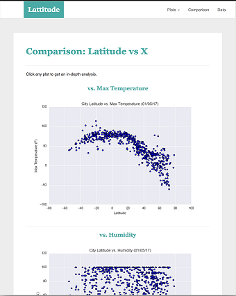

#### Data page

Large screen: 
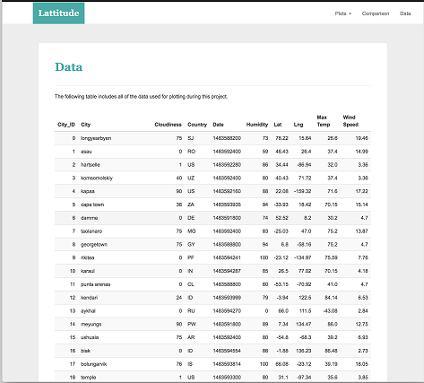

Small screen: 
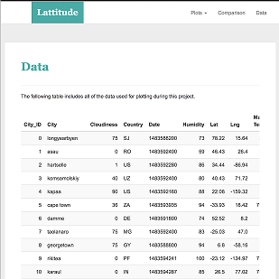

#### Visualization pages

Large screen: 
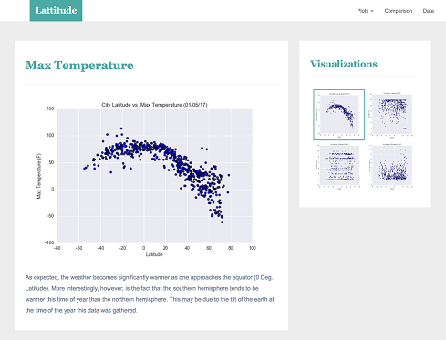

Small screen: 
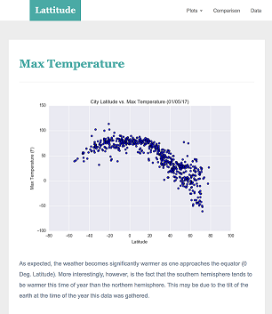

#### Navigation menu

Large screen: 
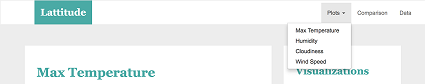

Small screen: 
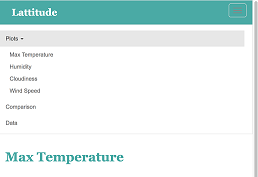
